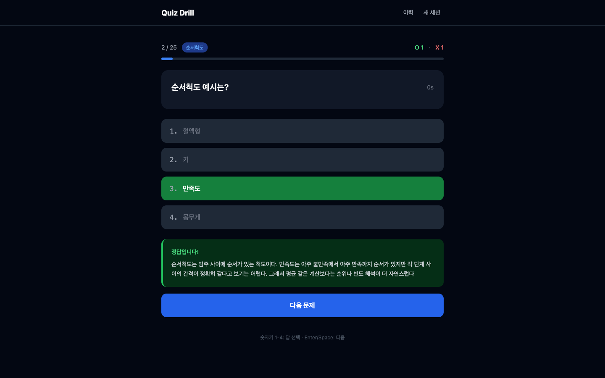
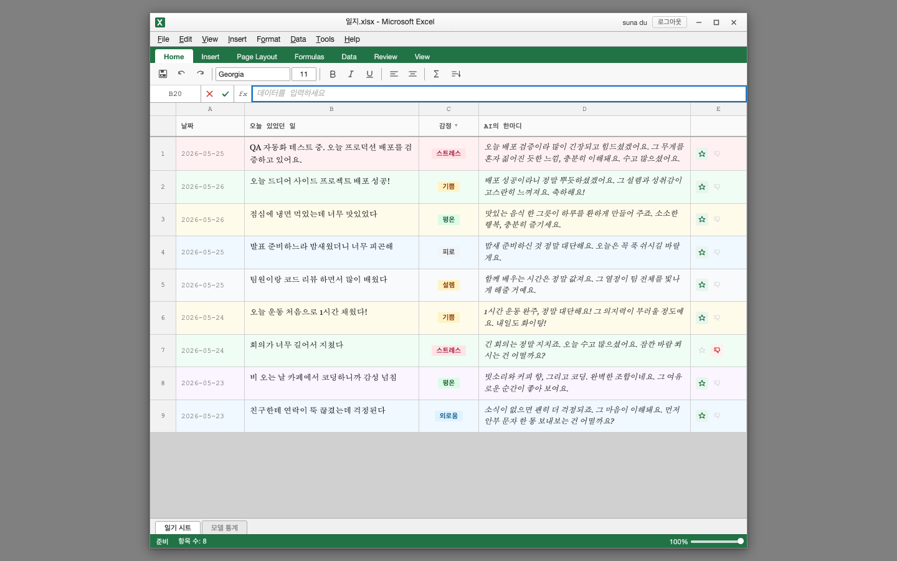

# UX Lab

## 📦 패키지/앱

| 패키지/앱 | 설명 | 시작일 | 작업자 | 기술 스택 |
| --- | --- | --- | --- | --- |
| **quiz-drill-ai** | CSV/TSV 기반 시험 대비 퀴즈 드릴 앱 ([앱](./apps/quiz-drill-ai), [배포](https://quiz-drill-ai.vercel.app/)) | 2026-06-13 |  |     |
| **projection-art** | WebGL 기반 인터랙티브 프로젝션 아트 PoC ([앱](./apps/projection-art)) | 2026-05-29 |  |    |
| **ai-empathy-diary** | Excel 위장 AI 감정 일기 앱 ([배포](https://ai-empathy-diary.vercel.app/)) | 2026-05-11 |  |    |
| **@ux-lab/stellas-archive** | 게임 ([개발 일지](https://github.com/dusunax/ux-lab/wiki/Development-Log#stellas-archive-game), [배포](https://ux-lab-stellas-archive.vercel.app/)) | 2026-03-14 | dusunax | |
| **@ux-lab/cad-viewer** | DXF 도면 확인용 CAD 뷰어 ([배포](https://ux-lab-cad-viewer.vercel.app/)) | 2026-02-23 | dusunax |    |
| **@ux-lab/seasonal-project-2025** | AI 기반 연말 사진 회고 웹 서비스 | 2025-12-20 | dusunax |    |
| **@ux-lab/applications** | 이력서 지원 현황 관리 앱 ([상세 문서](./apps/applications/README.md)) | 2025-11-24 | dusunax | - |
| **@ux-lab/flow** | UX Flow 다이어그램 에디터 | 2025-10-03 | dusunax |  |
| **@ux-lab/ui** | 공통 UI 컴포넌트 라이브러리 | - | dusunax | - |
| **@ux-lab/showcase** | 컴포넌트 쇼케이스 | - | dusunax | - |

## 📸 스크린샷

### 📍 quiz-drill-ai

- CSV/TSV와 내장 샘플 데이터 기반 퀴즈 세션 생성
- 숫자키 답 선택, Enter/Space 이동, 정답/오답 효과음 지원
- LocalStorage 기반 학습 이력과 오답 다시 풀기 제공



### 📍 projection-art

- WebGL/Three.js 기반 인터랙티브 프로젝션 아트 PoC
- 마우스, 손 추적, 전신 포즈 기반 반응형 비주얼 데모
- 프로젝터 실기기 시연을 기준으로 60fps 동작 검증

### 📍 ai-empathy-diary

- Excel UI로 위장한 AI 감정 일기
- 일기 입력 시 AI가 감정 분석 후 한마디 응답
- Firebase Auth 기반 인증 + Firestore 저장
- 모델별 피드백 통계 대시보드



### 📍 @ux-lab/cad-viewer

- DXF 도면 업로드 및 2D 뷰어
- 마우스/트랙패드 기반 확대/이동 조작


### 📍 @ux-lab/seasonal-project-2025

- 사진 분석 요청
- 원페이지 스크롤 이벤트
- PDF 저장
- Firebase 기반 일일 요청 횟수 제한


### 📍 @ux-lab/applications

- 원티드 PDF 파싱 후 리스트 생성
- 로컬 스토리지 기반 리스트 데이터 관리


### 📍 @ux-lab/flow


## 🚀 시작하기

```bash
# 의존성 설치
pnpm install

# 개발 서버 실행
pnpm -w run dev:all

# 브라우저에서 확인
# Showcase: http://localhost:3000
# Flow: http://localhost:3333
# Applications: http://localhost:3334
# Project Afterglow: http://localhost:3335
# Stella's Archive: http://localhost:3336
```

## 🔧 환경 설정

### Firebase 프로젝트 설정 시 

1. `.env.local` 파일 생성 (apps/flow/.env.example 참고)
2. Firebase 설정 값 입력

## 🛠️ 기술 스택

- React 19.1.0
- Next.js 15.5.2
- TypeScript 5.0+
- Tailwind CSS 3.4.0
- Firebase (@ux-lab/flow, @ux-lab/seasonal-project-2025)
- OpenAI API (@ux-lab/seasonal-project-2025)
- Framer Motion (@ux-lab/seasonal-project-2025)
- React Flow (@ux-lab/flow)
- Three.js, @react-three/fiber, @react-three/drei (@ux-lab/cad-viewer)
- three-dxf-viewer (DXF 렌더링)(@ux-lab/cad-viewer)
- pdfjs-dist (PDF 파싱)(@ux-lab/applications)
- EXIF 데이터 추출 (exifr) (@ux-lab/seasonal-project-2025)
