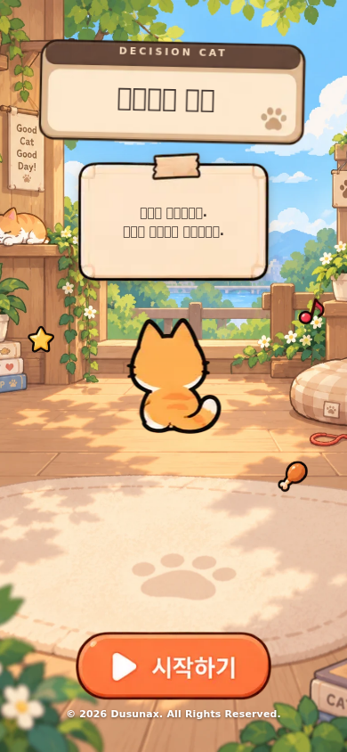

# cat-game — 고양이의 결정

고양이의 기본 이름은 **Jev**이고, 선택 화면에서 최대 10자까지 바꿀 수 있습니다.



사용자가 **상황**을 입력하면, 고양이가 타입별 행동 패턴과 현재 상태를 바탕으로 **스스로 행동을 결정**하는 게임입니다.
결정은 OpenRouter의 decisions 모델 `~typesafe/jev-latest`(Jev)가 내립니다.

## 실행

```bash
pnpm dev:openrouter   # 프록시 (http://localhost:3035, apps/openrouter-proxy/.env 의 OPENROUTER_KEY 필요)
pnpm dev:cat          # 게임   (http://localhost:5180)
```

프록시 주소가 다르면 `apps/cat-game/.env`에 `VITE_PROXY_URL`을 지정합니다. (`.env.example` 참고)

## 동작 방식

1. 사용자가 상황을 입력 (예: "초인종이 울렸다")
2. 클라이언트가 `state`(고양이 타입·성격·행동 패턴·성향·배고픔/에너지/친밀도·최근 사건 3개·상황)와
   `questions`를 만들어 `POST /api/decisions`로 전송
3. Jev가 아래 3개 질문에 답함
   - `action` (choice): 8개 행동 중 하나 + 행동별 확률
   - `mood` (choice): 결정 후 기분
   - `startled` (noul): 깜짝 놀랐을 확률
4. 선택된 행동에 따라 스탯이 변하고 로그에 확률 상위 3개가 표시됨
5. 프록시 호출이 실패(타임아웃 등)하면 타입별 가중치 + 상태(배고픔/피곤)로 고르는 **본능** 결정으로 대체하고 로그에 표시

## 시작 흐름

시작 → **집사는?**(이름·성별) → **고양이는?**(성격·이름·성별·나이) → 일상(채팅) → 기록.

- 집사는 이름(기본 `집사`, 최대 10자)과 성별(여자/남자)만 정합니다. 성별에 맞는 아바타가 채팅에서 내 말풍선 옆에 이름과 함께 표시되고, 이름·성별은 jev에게도 전달됩니다.
- 성격 목록의 마지막 칸은 **랜덤**입니다. 고르면 시작하는 순간 다섯 성격 중 하나로 정해집니다.

## 자동 저장

게임 진행 상태(고양이 설정, 스탯, 하트, 기록)는 브라우저 `localStorage`에 자동 저장됩니다.
페이지를 새로고침해도 이어서 플레이할 수 있고, 고양이를 변경하면 기존 저장 상태는 초기화됩니다.

## 하트(체력)

상태 카드 우측 상단에 하트 5칸이 있습니다(`features/cat/turn.ts`에서 정산).

- 한 턴의 결과로 0이 된 게이지(포만감·에너지·친밀도)가 하나라도 있으면 하트가 한 칸 줄어듭니다(한 턴에 최대 1칸).
- 게이지가 100%가 되면 **다음 턴**에 하트가 한 칸 차오르고, 새로 찬 칸이 반짝입니다. 같은 턴에 줄어들면 상쇄됩니다.
- 하트가 모두 없어지면 입력창 대신 "다시하기"가 나옵니다.

## 나이

고양이는 **1개월**부터 시작해, 상황을 2번 겪을 때마다 한 달씩 자랍니다(`age.ts`). 나이와 성장 단계(아기/청소년/성묘)는 Jev에게 함께 전달되어 행동 판단에 반영됩니다. 타입을 바꾸면 1개월로 초기화됩니다.

## 고양이 타입 (`features/cat/catTypes.ts`)

| 타입 | 패턴 요약 |
|---|---|
| 겁쟁이 | 큰 소리·낯선 존재에 숨음, 안심하면 부빔 |
| 장난꾸러기 | 움직이는 것에 달려듦, 지치면 곯아떨어짐 |
| 도도한 | 대부분 무시, 귀찮게 하면 하악질 |
| 먹보 | 음식이면 무조건 먹으러 감, 배부르면 잠 |
| 모험가 | 새로운 것은 먼저 살핌, 흥미 잃으면 이동 |

새 타입은 `catTypes.ts`에 항목을 추가하면 UI·요청·본능 결정에 모두 반영됩니다.

## 화면과 결정 차트

시작 → 고양이 선택 → 일상(채팅형 상황 입력) → 기록 흐름의 모바일 UI입니다. 고양이 변경은 하단 네비 중앙의 프로필 버튼으로 합니다. 데스크톱(430px 이상)에서는 390×844 기기 프레임을 가운데에 고정해 보여줍니다.
고양이 답변 말풍선에 jev 응답이 차트로 표시됩니다.

- 행동별 확률 막대 (선택된 행동 강조, 이모지 없음)
- 반올림해서 0%인 행동은 막대 대신 점차 흐려지는 스켈레톤 2줄로 접음 (접근성 라벨에 행동 이름 포함)
- 놀람·확신 원형 게이지, 기분

## 스프라이트

`assets/sprite-sheet.webp` 원본에서 `scripts/slice-sprites.py`로 `public/sprites/*.png`(투명 배경)를 잘라냅니다.

```bash
python3 apps/cat-game/scripts/slice-sprites.py   # Pillow, numpy, scipy 필요
```

시트에는 주황 고양이만 있어 타입별 색은 CSS 필터로 만듭니다(`CatAvatar.tsx`의 `TYPE_FILTER`).
원본 조각이 약 110px라 확대하면 흐려지므로, 이미지는 원본 크기 이하로만 표시합니다(랜딩 고양이 120px, 소품 30~70px).
랜딩(`StartScreen`)은 방 일러스트 배경 위에 뒷모습 고양이(`cat-back`)를 애니메이션 없이 정중앙에 두고, 나무 판 타이틀과 소품에만 CSS 애니메이션을 줍니다. `prefers-reduced-motion`에서는 멈춥니다.

### 집사·버튼 시트

`assets/sheet-ui.webp`(집사 캐릭터·텍스트 버튼)는 배경이 투명한 시트입니다. `scripts/sheet_utils.py`가 손실 압축으로 남은
알파 잔상을 정리한 뒤 `scripts/slice-owner-ui.py`가 집사 아바타(`owner-*.png`, `owner-*-head.png`)와 이미지 버튼(`btn-*.png`)을 잘라냅니다.

```bash
python3 apps/cat-game/scripts/slice-owner-ui.py
```

`assets/sheet-owner.webp`(집사 캐릭터 시트)는 캐릭터 대신 하단 네비 아이콘 판(`nav-plate-*.png`)을 자르는 데 씁니다.

### 반응형

- 마우스가 있는 넓은 데스크톱(폭 1024px 이상)은 390×844 폰 프레임을 가운데에 고정해 보여주고, 창이 낮으면 비율대로 줄입니다.
- 그보다 좁은 화면(큰 폰·작은 태블릿·좁은 창)과 터치 기기는 프레임 없이 모바일 레이아웃입니다(폭 431px 이상이면 최대 500px 컬럼을 가운데에 둡니다). `viewport-fit=cover`와 `env(safe-area-inset-*)`로 노치·홈 인디케이터를 피하고, 키보드가 열리면 화면 높이가 함께 줄어듭니다(`interactive-widget=resizes-content`).
- 키 ≤ 740px, ≤ 700px, ≤ 520px와 폭 ≤ 360px 구간에서 여백·크기를 줄여, 320×568까지 선택 화면이 스크롤 없이 들어갑니다.

### 모바일 키보드

터치 기기(`pointer: coarse`)에서만 동작합니다(`useKeyboardOpen.ts`).

- 입력창에 포커스가 있고 보이는 영역(`visualViewport`)이 120px 이상 줄면 키보드가 열린 것으로 보고 `.phone--keyboard`를 붙입니다. 이때 상단 게이지는 한 줄로 줄고(128px → 60px), 예시 칩과 하단 메뉴는 숨겨 채팅 영역을 넓힙니다.
- 보이는 영역 높이(`--vvh`)와 위쪽 오프셋(`--vv-top`)을 `.phone`에 반영해, 레이아웃 뷰포트가 줄지 않는 iOS Safari에서도 키보드 위로 화면이 맞춰집니다.
- 모바일에서는 결정이 끝나도 자동으로 입력창에 포커스하지 않고, 전송하면 입력창 포커스를 풀어 키보드를 닫습니다. 데스크톱은 기존처럼 자동 포커스합니다.

### 행동 판정

고양이는 **확률이 가장 높은 행동**을 합니다. jev 응답은 화면의 확률 표에서 1위인 행동을 그대로 쓰고, 본능 결정도
타입 가중치 + 상태 + 상황(시드)으로 확률을 만든 뒤 1위를 고릅니다(같은 상황·같은 턴이면 같은 결과).

### 세션 기록에 따라 달라지는 4가지 (멀티턴, `features/cat/session.ts`)

이전 턴들의 기록이 아래 4가지로 이번 반응에 영향을 주고, jev 요청의 `state.session`에도 요약되어 전달됩니다.
영향을 준 항목은 말풍선 아래 칩으로 표시됩니다.

| 항목 | 조건 | 효과 |
|---|---|---|
| 익숙해짐 | 같은 상황을 다시 겪음(공백·문장부호 무시) | 놀람 게이지가 반복마다 ×0.6 |
| 싫증 | 같은 행동이 2번 이상 이어진 뒤 또 같은 행동 | 에너지 -5 추가, 본능 결정에서는 그 행동 가중치 ×0.5 |
| 유대 | 친밀도 ≥ 70(친밀) / ≤ 20(경계) | 울음소리 끝이 `골골~` / `…`, 본능 결정에서 다가감·숨음 가중치 조정 |
| 기분 | 평온이 아닌 같은 기분이 2턴 연속 | 본능 결정에서 그 기분에 맞는 행동 가중치 상승(불안→숨기 등) |

### 기록 화면

- 상단 카드: "{이름}와 함께한 시간"(상황 2번마다 한 달) · 결정 횟수 · 나이
- 최근 결정: 행동에 따라 다른 고양이 이미지
- 통계: 행동별 횟수 세로 막대 그래프(가장 많이 한 행동 강조)

> 높이(`max-height`/`min-height`) 기준의 반응형 규칙은 실제 모바일·태블릿에만 적용합니다. 데스크톱의 폰 프레임은 항상 390×844 안쪽 크기라, 창 높이에 따라 규칙이 바뀌면 오히려 넘칠 수 있기 때문입니다(창이 낮으면 프레임 전체를 비율대로 줄입니다).

### 결정 실패(본능 대체)

프록시 호출이 실패하면 타입별 성향 + 상태(배고픔·피곤)로 고르는 **본능 결정**으로 대체하고, 차트 제목에 이유를 표시합니다.
`서버에 연결할 수 없어요`(프록시 꺼짐/주소 오류) · `jev의 응답이 늦어졌어요`(25초 초과, 프록시 504) · `서버에서 오류가 났어요` · `jev의 응답을 읽지 못했어요`.
본능 결정에는 놀람·확신 게이지가 없고 확률은 성향 가중치입니다.

### 배경

- 랜딩 배경: `public/backgrounds/main.webp` (방 일러스트)
- 집사 선택 배경: `public/backgrounds/owner-room.webp` (침실 일러스트, 확대 없이 카드 폭에 맞춰 아래쪽 기준으로 자름)
- 페이지 하단 잔디: `public/backgrounds/grass.webp` (투명 배경, 폭 100%로 깔고 폰 양옆에 소품 배치)

## 구조

```
src/features/cat/
├── actions.ts        # 8개 행동, 스탯 변화, 서술
├── age.ts            # 나이(1개월 시작)와 성장 단계
├── catTypes.ts       # 타입별 성격·패턴·성향 가중치
├── decideApi.ts      # Jev 요청 생성 + 응답 zod 검증
├── instinct.ts       # 오프라인 본능 결정
├── expression.ts     # 행동 → 표정(스프라이트) 매핑
├── useCatGame.ts     # 게임 상태
└── components/       # 화면·채팅·DecisionChart 등
```

## 라이선스

© 2026 Dusunax. All Rights Reserved.

화면의 저작권 표기(`Copyright.tsx`)는 현재 연도를 따라갑니다. 넓은 데스크톱에서는 페이지 하단(잔디 위), 좁은 화면과 모바일에서는 랜딩 하단에 한 번만 표시됩니다.
