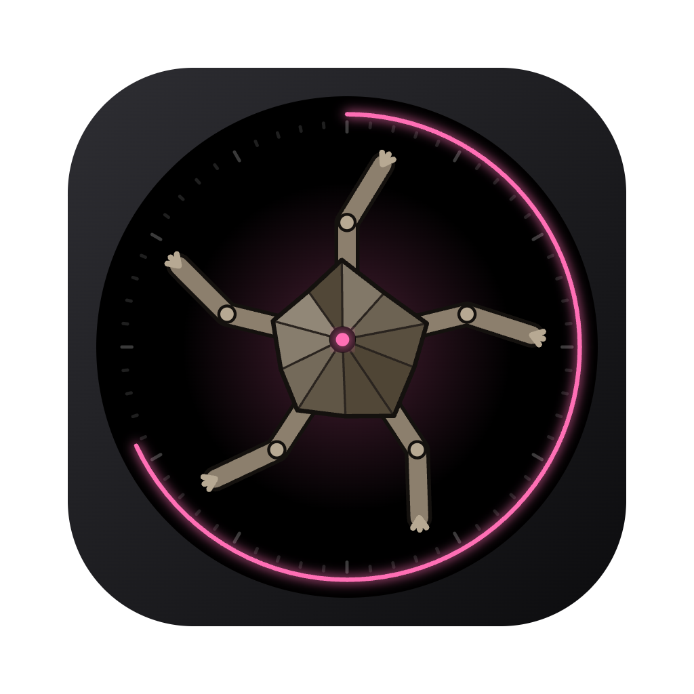

<div align="center">



# Tuffy

**말을 걸면 스스로 생각하고, 감정과 몸짓으로 대답하는 원형 데스크탑 친구**

리시언(Lithian) 외계 과학자 터피 · 바위 등딱지 · 다리 다섯 개 · 눈 없음 · 화음으로 말함


</div>

> 『프로젝트 헤일메리』에 대한 오마주. 캐릭터·종족 고유명사만 바꾸고, 말버릇과 라벨(`AMAZE`, `~, 질문?`)은 아는 사람은 알아보도록 남겨 두었다.

## 무엇을 하나

- **듣는다** — 텍스트 대화, 마이크(이름 부르기·대화·허밍·큰 소리), 자리 복귀, 정각, 활성 앱.
- **생각한다** — 룰 기반 반사가 바로 몸을 움직이고, 중요한 신호만 LLM·jev가 숙고한다. 25초 동안 조용하면 혼자 생각한다.
- **표현한다** — 감정 6가지 × 동작 8가지, 숨구멍 발광, 감정별 화음, 원형 화면 아래로 흐르는 한 줄 대답.
- **기억한다** — 오늘 나눈 대화와 최근 8줄을 로컬에 저장해 다음 실행에도 이어간다.

<table>
  <tr>
    <td align="center"><br /><sub><b>CALM · IDLE</b><br />숨구멍만 천천히 깜빡</sub></td>
    <td align="center"><br /><sub><b>CALM · WAVE</b><br />"친구 왔다. 손 흔들어. 좋아."</sub></td>
    <td align="center"><br /><sub><b>AMAZE · BOUNCE</b><br />화음 음표를 뿌리며 통통</sub></td>
  </tr>
  <tr>
    <td align="center"><br /><sub><b>THINK</b><br />LLM을 기다리는 동안 "생각 중 · · ·"</sub></td>
    <td align="center"><br /><sub><b>WORRIED · SCUTTLE</b><br />새벽 3시엔 서성이며 걱정</sub></td>
    <td align="center"><br /><sub><b>SLEEPY · CURL</b><br />에너지가 떨어지면 몸을 말고 잠</sub></td>
  </tr>
</table>

## 뇌 콘솔


터피가 무엇을 듣고 어떻게 생각했는지 그대로 보여 주는 개발자 창이다.

- **엔진 선택** — `무료 LLM` / `jev · 유료`. 옆에 오늘 무료 호출 수와 jev 비용
- **TypeSafe 키** — 붙여 넣으면 키체인 기반으로 암호화 저장
- **대화 입력** — 터피에게 말 걸기
- **MIC 진단** — 입력 장치, 실시간 레벨과 판단 기준선, whisper 인식 결과
- **사고 로그** — 최신순, 태그 필터(Alt+클릭이면 그 태그만)와 검색
- **DECISION** — 평가·감정·동작 확률 막대

창을 닫았다면 `Cmd+Shift+B`로 다시 연다.

<br clear="right" />

## 문서

| 문서 | 내용 |
|---|---|
| [컨셉](docs/concept.md) | 캐릭터, 오마주, 표현 수단, 감정·색·화음, 디자인 원칙 |
| [동작](docs/behavior.md) | 생각의 흐름, 신호와 salience, 판단 계약, 대답 모음("화났어?" vs "화났어."), 엔진·비용·키, 반응 속도, 음성 인식, 제약 |
| [결정 기록](docs/decisions.md) | 결정 D1~D11, 열린 질문 OQ-1~6 |

## 시작하기

```bash
pnpm install                                   # 레포 루트에서
cp apps/tuffy/.env.example apps/tuffy/.env
pnpm --filter openrouter-proxy dev             # 무료 LLM 경로 (없으면 본능으로만 판단)
pnpm --filter tuffy dev
```

- 원형 창(300px, 항상 위)이 화면 오른쪽 아래에 뜬다. 원을 드래그해 옮긴다.
- 마이크와 화음 소리는 꺼진 채 시작한다. 콘솔에서 켠다.

<details>
<summary><b>음성 인식 준비 (whisper.cpp, 한 번만)</b></summary>

없으면 마이크는 허밍·큰 소리만 감지한다.

```bash
brew install whisper.cpp
mkdir -p ~/Library/Application\ Support/tuffy/models
curl -L -o ~/Library/Application\ Support/tuffy/models/ggml-large-v3-turbo-q5_0.bin \
  https://huggingface.co/ggerganov/whisper.cpp/resolve/main/ggml-large-v3-turbo-q5_0.bin   # 574MB
```

</details>

<details>
<summary><b>macOS 앱으로 패키징</b></summary>

```bash
pnpm --filter tuffy dist:mac   # dist/Tuffy-0.1.0-arm64.dmg, dist/mac-arm64/Tuffy.app
pnpm --filter tuffy icon       # 아이콘(build/icon.png·icon.icns) 다시 만들기
```

- Apple Silicon(arm64)용, 개발자 인증서가 없어 ad-hoc 서명이다. 다른 Mac에서 처음 열 때는 Finder에서 우클릭 → 열기.
- `.env`의 `MAIN_VITE_*` 값은 빌드할 때 앱에 박힌다. 값을 바꾸면 다시 패키징한다. TypeSafe 키는 박히지 않는다(콘솔에서 등록).
- 패키징한 앱도 openrouter-proxy(localhost:3035)와 whisper.cpp를 그대로 쓴다.
- 데이터 폴더는 `~/Library/Application Support/Tuffy`. APFS 기본(대소문자 무시)이면 개발 실행의 `tuffy` 폴더와 같아 기억·호출 횟수·whisper 모델이 이어진다.
- 앱 아이디가 개발 실행(Electron)과 달라 처음 마이크를 켜면 macOS 권한을 다시 묻는다.

</details>

## 개발

```bash
pnpm --filter tuffy test        # 판단 계약·라우터·엔진·대답 모음·음성 해석·음높이 검출
pnpm --filter tuffy typecheck
```

<details>
<summary><b>코드 구조</b></summary>

```
src/
├── shared/state.ts           상태 어휘(emotion·motion·signal·engine), 기억·신호 sanitize
├── shared/ipc.ts             채널과 window.api 타입
├── main/
│   ├── brain/brain.ts        뇌: sense → reflex → 숙고 → act, 자율 틱, 무료 예산·jev 비용
│   ├── brain/reflex.ts       룰 기반 즉시 반응 + salience
│   ├── brain/engines.ts      엔진 고르기: jev(평가 → 표현+대답) / 무료 LLM / 본능, 늦은 말
│   ├── brain/mind.ts         판단 질문(APPRAISE·EXPRESS·REPLY), state, 답 → 몸·사고 로그
│   ├── brain/lines.ts        jev 대답 모음 181개 ({ when, say })
│   ├── brain/instinct.ts     로컬 본능 (LLM을 아낄 때·실패할 때)
│   ├── brain/decide/questions.ts   jev 형식 타입 안전 질문 키트
│   ├── brain/decide/deciders.ts    무료 LLM 판단·대사, TypeSafe jev 호출
│   ├── brain/decide/freeRouter.ts  무료 모델 전용 호출기
│   ├── sensors/desktop.ts    자리 복귀·유휴·정각·활성 앱(macOS lsappinfo)
│   ├── sensors/whisper.ts    whisper-server 자식 프로세스(127.0.0.1:8178)
│   ├── sensors/speech.ts     STT 해석(이름 부르기·환각 문구·허밍 판정), WAV 인코딩
│   ├── secrets.ts            TypeSafe 키 safeStorage 저장
│   └── windows.ts            원형 디바이스 창, 뇌 콘솔 창
└── renderer/
    ├── device/               몸: SVG 리그, 화음, 마이크(허밍·큰 소리·음성 구간 VAD), 기억 localStorage
    └── console/              사고 로그·필터, 엔진·키, MIC 진단, DECISION, 대화 입력
```

뇌는 main 프로세스에 있고 상태값만 내보낸다. 몸(device)은 그 값을 받아 그린다. 기억은 device 창의 localStorage(`tuffy.memory`)에 저장하고, 부팅 때 main이 검증한 뒤 쓴다.

</details>
