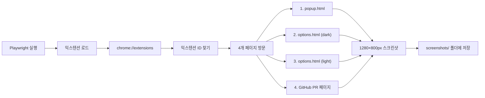

# Playwright로 스크린샷 자동 생성

Playwright를 사용하여 Chrome Web Store용 스크린샷을 자동으로 생성하는 스크립트입니다.

---

## 📋 필수 조건

- Node.js 16+ 설치됨
- 현재 폴더: `extensions/chrome-capture/`

---

## 🚀 실행 방법

### 1단계: 의존성 설치

```bash
cd /Users/du/repository/ux-lab/extensions/chrome-capture
npm install
```

### 2단계: 스크린샷 생성 실행

```bash
npm run generate-screenshots
```

### 3단계: 스크린샷 확인

생성된 스크린샷은 다음 위치에 저장됩니다:

```
extensions/chrome-capture/screenshots/
├── 1-main-ui.png              (팝업 - 요소 선택)
├── 2-settings-dark.png        (설정 - 다크모드)
├── 3-settings-light.png       (설정 - 라이트모드)
└── 4-github-example.png       (GitHub PR - 실제 사용)
```

---

## 🔍 스크립트 동작 원리



### 생성되는 스크린샷들

| # | 파일명 | 페이지 | 상태 | 설명 |
|---|--------|--------|------|------|
| 1 | 1-main-ui.png | popup.html | - | CSS 선택자 입력하고 요소 선택 |
| 2 | 2-settings-dark.png | options.html | 다크모드 | 다크 테마 설정 페이지 |
| 3 | 3-settings-light.png | options.html | 라이트모드 | 라이트 테마 설정 페이지 |
| 4 | 4-github-example.png | GitHub PR | - | 실제 GitHub PR에서 button 요소 하이라이트 |

---

## 🎨 스크린샷 커스터마이징

### 1. 선택자 변경

`scripts/generate-screenshots.js` 파일에서:

```javascript
// 기본값: 'button'
// 다른 선택자로 변경하려면:
await popupPage.evaluate(() => {
  const input = document.getElementById('selectorInput');
  if (input) {
    input.value = '.navbar';  // 변경하려는 선택자
    // ...
  }
});
```

### 2. GitHub URL 변경

실제 프로젝트의 PR URL로 변경:

```javascript
// 현재: GitHub PR #52
await githubPage.goto('https://github.com/YOUR_USERNAME/YOUR_REPO/pull/YOUR_PR', {
  waitUntil: 'networkidle',
});
```

### 3. 뷰포트 크기 변경

다른 크기로 스크린샷을 생성하려면:

```javascript
await popupPage.setViewportSize({ width: 640, height: 400 });
// 또는
await popupPage.setViewportSize({ width: 1920, height: 1080 });
```

---

## ⚙️ 고급 옵션

### 헤드풀 모드 (UI 보이며 실행)

```bash
# 스크립트의 headless 옵션을 false로 변경
# headless: false ← 이 줄을 주석 처리
```

### 디버깅 정보 보기

```bash
# 환경 변수 설정
DEBUG=pw:api npm run generate-screenshots
```

### 느린 연결 시뮬레이션

스크립트에 추가:

```javascript
await page.route('**/*', async (route) => {
  setTimeout(() => route.continue(), 100);
});
```

---

## 🐛 트러블슈팅

### "익스텐션을 찾을 수 없습니다" 에러

**문제**: 자동으로 익스텐션 ID를 찾지 못함

**해결책**:

1. Chrome 개발자 모드에서 익스텐션 ID 확인:
   - `chrome://extensions` 접속
   - "개발자 모드" 활성화
   - 익스텐션의 ID 복사

2. 스크립트 수정 (`scripts/generate-screenshots.js`):

```javascript
// 자동 찾기 대신 직접 입력
const extensionId = 'YOUR_EXTENSION_ID_HERE';
```

### GitHub 로그인 필요 에러

**문제**: GitHub PR 페이지에 로그인이 필요함

**해결책**:

1. 비공개 저장소인 경우, 스크립트를 수정하여 인증 정보 추가:

```javascript
// 쿠키나 토큰으로 인증 (선택사항)
await githubPage.context().addCookies([
  {
    name: 'authenticated_user',
    value: 'your_github_username',
    url: 'https://github.com',
  },
]);
```

### 스크린샷이 검은색으로 나옴

**문제**: 페이지 로딩이 완료되지 않음

**해결책**: `waitForTimeout` 값을 늘리기

```javascript
await page.waitForTimeout(2000); // 500ms → 2000ms로 변경
```

---

## 📤 Chrome Web Store 업로드

생성된 스크린샷을 Chrome Web Store에 업로드:

1. [Chrome Web Store Developer Dashboard](https://chrome.google.com/webstore/devconsole) 접속
2. 프로젝트 선택 → "그래픽 자산"
3. 각 스크린샷 업로드:
   - `1-main-ui.png` → "메인 UI"
   - `2-settings-dark.png` → "설정 - 다크모드"
   - `3-settings-light.png` → "설정 - 라이트모드"
   - `4-github-example.png` → "실제 사용"

---

## 📝 스크립트 구조

```
scripts/
└── generate-screenshots.js
    ├── Playwright 초기화
    ├── 익스텐션 로드
    ├── 익스텐션 ID 자동 검색
    ├── 4개 스크린샷 생성
    │   ├── popup.html (선택자 입력)
    │   ├── options.html (다크모드)
    │   ├── options.html (라이트모드)
    │   └── GitHub PR (하이라이트)
    └── screenshots/ 폴더에 저장
```

---

## 🎯 자동화 체크리스트

- [x] Playwright로 Chrome 실행
- [x] 익스텐션 자동 로드
- [x] 익스텐션 ID 자동 검색
- [x] popup.html 스크린샷
- [x] options.html (다크모드) 스크린샷
- [x] options.html (라이트모드) 스크린샷
- [x] GitHub PR 페이지 스크린샷
- [x] 1280×800px PNG 저장
- [ ] 스크린샷 자동 최적화 (선택사항)
- [ ] 자동 Web Store 업로드 (선택사항)

---

## 🔗 참고자료

- [Playwright 공식 문서](https://playwright.dev)
- [Chrome Web Store 스크린샷 가이드](https://support.google.com/chrome/a/answer/2714278)
- [Node.js 공식 사이트](https://nodejs.org)

---

## 💡 팁

### 재사용 가능한 스크립트

향후 다시 스크린샷을 생성해야 할 때:

```bash
npm run generate-screenshots
```

### 배치 처리

여러 익스텐션의 스크린샷을 한 번에 생성하려면, 스크립트를 복사하고 경로만 변경하면 됩니다.

### Git 무시

`screenshots/` 폴더는 git에서 무시하려면 `.gitignore`에 추가:

```
extensions/chrome-capture/screenshots/
```
